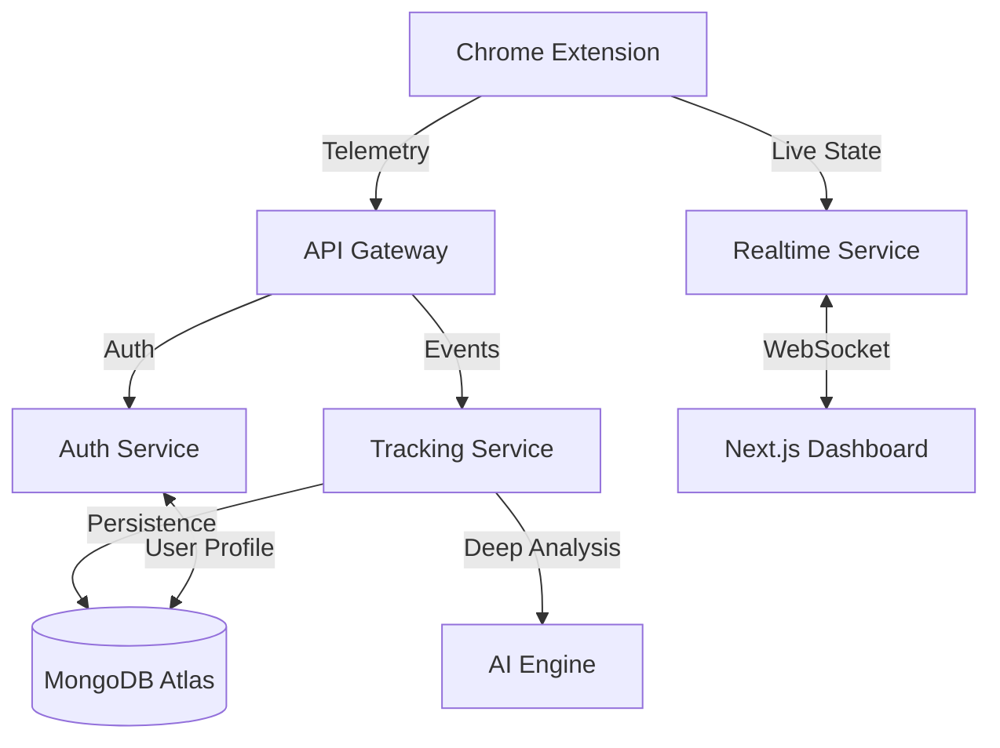

# 🦅 AERO | The Future of Productivity Engineering

> **Elevate your workflow with AI-driven insights and a resilient microservices architecture.**

**AERO** is an advanced, AI-powered productivity ecosystem designed for high-performers. It bridges the gap between deep-work sessions and actionable intelligence through a sophisticated **Chrome Extension** and a **Next.js Real-time Dashboard**.

---

## ✨ System Highlights

| Feature | Description | Engine |
| :--- | :--- | :--- |
| **🧠 Cognitive AI** | Real-time mental fatigue & context-switching analysis. | `ai-service` |
| **🛡️ Focus Shield** | Neural-based website blocking with Strict Mode enforcement. | `tracking-service` |
| **📡 Live Sync** | Zero-latency synchronization between Extension & Dashboard. | `realtime-service` (WS) |
| **📊 Glass Analytics** | Stunning D3.js & Recharts visualizations for deep data mining. | `Next.js 14` |

---

## 🌟 Our Vision
In an age of digital distraction, AERO's mission is to give you back your focus. By leveraging **Neural Inference**, we don't just track *where* you spend time, but *how* that time impacts your cognitive state. AERO is built to be the "Second Brain" for your productivity, auto-adjusting your environment to keep you in the Flow Zone.

---

## 🏗️ Technical Architecture

### **Data Flow Architecture**


---

## 🛠️ Comprehensive Tech Stack

### **Frontend & Visualization**
- ⚛️ **Next.js 14**: App Router, Server Actions, and SSR for maximum performance.
- 🎨 **Tailwind CSS**: Utility-first CSS for a sleek, responsive Glassmorphism UI.
- 🎭 **Framer Motion**: Fluid, hardware-accelerated micro-interactions.
- 📊 **D3.js & Recharts**: High-fidelity data visualizations for cognitive load.
- 🧩 **Lucide React**: Premium iconography for a modern aesthetic.

### **Backend & Infrastructure**
- 💾 **MongoDB Atlas**: Scalable NoSQL storage for high-velocity telemetry.
- ⚡ **Redis**: In-memory caching and real-time message brokering.
- 🐳 **Docker & Compose**: Containerized orchestration for seamless deployment.

---

## 🧩 Internal Service Deep-Dive

### **1. Chrome Extension (The Observer)**
The core tracking engine resides in the extension's background service worker and content scripts.
- **Manifest V3**: Uses modern Chrome APIs for background persistence.
- **Content Scripts**: Injected into every tab to capture `document.title` and monitor active focus.
- **Background Worker**: Handles the polling logic and batching of telemetry to minimize network overhead.
- **Storage API**: Locally caches blocklists for zero-latency blocking even when offline.

### **2. Auth Service (`:5001`)**
Manages the user lifecycle and security.
- **JWT Implementation**: Uses short-lived access tokens and long-lived refresh tokens.
- **Google OAuth**: Integrated Passport strategy for one-click onboarding.
- **Preference Sync**: Stores theme, notification, and Pomodoro settings centrally.

### **3. Tracking Service (`:5002`)**
The high-velocity data ingestion engine.
- **Aggregation Logic**: Transforms raw per-second telemetry into meaningful hourly/daily buckets.
- **Goal Engine**: Calculates progress against user-defined targets in real-time.
- **Heatmap Generation**: Generates GitHub-style activity maps for long-term trend analysis.

### **4. AI Service (`:8000`)**
FastAPI-based Python engine for cognitive analysis.
- **NLP Classifier**: Uses a lightweight Transformer model to categorize URLs and page titles.
- **Fatigue Heuristic**: Analyzes context-switching frequency to generate a "Cognitive Load" score (1-10).

---

## 📡 API Documentation (Key Endpoints)

### **Auth API**
| Method | Endpoint | Description |
| :--- | :--- | :--- |
| `POST` | `/api/auth/register` | Create a new enterprise account |
| `POST` | `/api/auth/login` | Secure JWT-based login |
| `GET` | `/api/auth/me` | Fetch authenticated user profile |
| `PUT` | `/api/auth/preferences`| Update theme/notifications/focus settings |

### **Tracking API**
| Method | Endpoint | Description |
| :--- | :--- | :--- |
| `POST` | `/api/tracking` | Ingest raw telemetry session |
| `GET` | `/api/tracking/stats` | Aggregate dashboard metrics |
| `GET` | `/api/tracking/cognitive-load`| Fetch D3.js load-time data |
| `GET` | `/api/tracking/heatmap` | GitHub-style activity data |

---

## 💾 Database Schema (MongoDB Atlas)

### **User Document**
- `preferences`: { `theme`, `notifications`, `pomodoroWork`, `strictMode`, etc. }
- `googleId`: (Optional) for OAuth users.
- `lastSeen`: Updated on every dashboard visit.

### **Tracking Document**
- `website`: Cleaned URL.
- `time`: Duration in seconds.
- `category`: `productive` | `unproductive` | `neutral`.
- `date`: Timestamp for aggregation.

---

## 🔄 The AERO Workflow (The 4-Step Cycle)

1.  **Capture**: The Extension monitors your active tab, capturing Title, URL, and Duration every second.
2.  **Classify**: Data is hashed and sent to the AI Engine. NLP models determine if the site is "Deep Work" or "Distraction".
3.  **Shield**: If distractions exceed your threshold, the **Focus Shield** activates, enforcing your blocklist across all devices.
4.  **Reflect**: Use the Dashboard to review your **Momentum Score** and adjust your goals for the next sprint.

---

## 🛣️ Roadmap

- [ ] **Mobile Companion**: iOS/Android app for cross-platform focus.
- [ ] **Team Analytics**: Productivity benchmarking for engineering teams.
- [ ] **Smart Scheduling**: Suggesting deep-work blocks based on your peak AI hours.
- [ ] **Integrations**: Auto-sync with Jira, GitHub, and Slack to correlate work output.

---

## 🚀 Deployment & Installation

### **Prerequisites**
- **Node.js** v18+ & **Docker Desktop**
- A **MongoDB Atlas** cluster (Free Tier works great!)

### **Quick Start**
```ps1
# 1. Clone & Install
git clone https://github.com/your-username/aero.git
cd aero
npm install

# 2. Configure ENVs (See .env.example)
cp .env.example .env

# 3. Launch the Engine
./start-all.ps1
```

---
---

⭐ **Star the AERO repository to support open-source productivity!** 🦅

[Developed by the AERO Engineering Team • Built for High-Performers]
